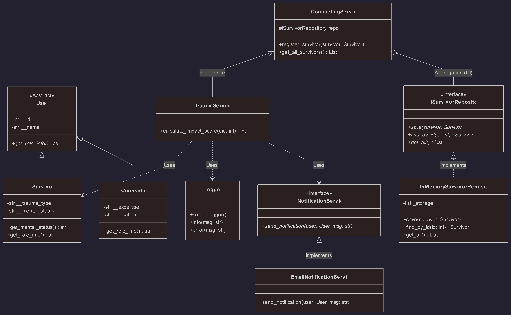

# Sistem Layanan Dukungan Psikososial (Trauma Healing CLI)

Aplikasi berbasis **Command Line Interface (CLI)** ini dirancang untuk mengelola data korban bencana alam serta melakukan asesmen awal kesehatan mental (*Trauma Healing*). Proyek ini dibangun sebagai Tugas Besar Pemrograman Berorientasi Objek (PBO) dengan menerapkan standar **Layered Architecture**, **SOLID Principles**, **Unit Testing**, dan **Data Persistence (JSON)**.

---

## Latar Belakang
Dalam situasi pasca-bencana, pendataan korban dan identifikasi tingkat trauma seringkali tidak terorganisir dengan baik. Sistem ini dikembangkan untuk memberikan solusi teknis berupa:
* **Dokumentasi Terstruktur:** Menyimpan informasi korban secara rapi, sistematis, dan mudah diakses.
* **Asesmen Otomatis:** Melakukan kalkulasi skor (*scoring*) tingkat trauma korban (Ringan/Sedang/Berat) berdasarkan parameter mental yang terukur.
* **Transparansi Sistem:** Menyediakan rekam jejak (*logging*) aktivitas sistem yang akurat dan berbasis waktu (*real-time*).

---

## Struktur Proyek
Sistem ini menggunakan **Layered Architecture** untuk memisahkan tanggung jawab (*concern*) antara data, logika bisnis, dan antarmuka.

```
UAS_Trauma_Healing/
│
├── models/             # [Entity Layer] Representasi Objek Nyata
│   ├── __init__.py
│   └── users.py        # Abstract Class (User) & Serialisasi JSON
│
├── repositories/       # [Data Layer] Manipulasi Penyimpanan Data
│   ├── __init__.py
│   ├── survivor_repo.py # Interface (ISurvivorRepository) - Kontrak DIP
│   └── json_repo.py     # Implementasi Penyimpanan File JSON
│
├── services/           # [Logic Layer] Aturan Bisnis & Algoritma
│   ├── __init__.py
│   └── counseling.py   # Parent (CounselingService) & Child (TraumaService)
│
├── utils/              # [Utility Layer] Fungsi Bantuan
│   ├── __init__.py
│   ├── logger.py       # Konfigurasi Logging dengan Timestamp
│   └── notifications.py# Abstraksi Sistem Notifikasi (OCP)
│
├── tests/              # [Testing Layer] Pengujian Reliabilitas
│   ├── __init__.py
│   └── test_service.py # Unit Test (CRUD, Logic, Validation)
│
├── main.py             # [Presentation Layer] Orchestrator / Entry Point
├── data_korban.json    # [Database] File penyimpanan data permanen
├── uml.png             # [Docs] Diagram Arsitektur
└── README.md           # Dokumentasi Proyek

```

---

## Implementasi Teknis (OOP & SOLID)

Sistem ini dinilai berdasarkan penerapan konsep-konsep berikut:

### 1. Object-Oriented Programming (OOP)

* **Encapsulation:** Seluruh atribut vital (seperti `__id`, `__mental_status`) bersifat **Private** dan hanya bisa diakses melalui Getter/Setter tervalidasi.
* **Inheritance:** `TraumaService` (Child) mewarisi `CounselingService` (Parent); `Survivor` mewarisi `User`.
* **Polymorphism:** Method `get_role_info()` dan `to_dict()` memiliki implementasi berbeda pada setiap entitas turunan.
* **Abstraction:** Menggunakan `ABC` (*Abstract Base Class*) pada `User` dan Interface pada Repository.

### 2. SOLID Principles

* **SRP (Single Responsibility):** Pemisahan tegas: `json_repo.py` hanya mengurus file, `counseling.py` hanya mengurus logika skor.
* **OCP (Open/Closed):** Modul notifikasi dan repository dirancang agar mudah diperluas tanpa memodifikasi kode inti.
* **DIP (Dependency Inversion):** `TraumaService` tidak bergantung pada class konkret repository, melainkan pada kontrak interface `ISurvivorRepository`.

---

## Fitur Utama

1. **Penyimpanan Permanen (JSON Storage):** Data korban disimpan dalam file `data_korban.json` secara otomatis. Data tidak hilang meskipun aplikasi ditutup.
2. **Manajemen Korban (CRUD):** Pencatatan data dengan validasi input yang ketat (cegah data kosong/invalid).
3. **Trauma Scoring System:** Algoritma otomatis menghitung skor dampak (30-90) berdasarkan status mental (Ringan/Sedang/Berat).
4. **Real-time Logging:** Setiap transaksi (sukses/gagal) direkam ke `logs/app.log` dengan Timestamp presisi.
5. **Robust Error Handling:** Sistem tahan banting terhadap input salah atau file korup tanpa menyebabkan *crash*.

---

## Desain UML



Struktur kode dibangun berdasarkan rancangan UML Class Diagram berikut:

> **Keterangan Diagram:**
> * **Service Layer:** `TraumaService` (Child) mewarisi `CounselingService` (Parent) untuk memperluas kapabilitas asesmen.
> * **Data Layer:** `ISurvivorRepository` bertindak sebagai kontrak (Interface). Pada implementasi final, digunakan `JsonSurvivorRepository` (menggantikan `InMemory` pada diagram) untuk persistensi data.
> * **Model:** `Survivor` dan `Counselor` adalah turunan dari Abstract Class `User`.
> * **Utility:** `NotificationService` menerapkan pola Observer/Interface untuk fleksibilitas notifikasi.

---

---

## Cara Menggunakan


1. **Jalankan aplikasi**
   ```bash
   python main.py
   ```

2. **Menu Utama**
   ```
   === SISTEM TRAUMA HEALING (JSON STORAGE) ===

    Menu Utama:
    1. Daftar Korban
    2. Lihat Data
    3. Cek Skor Dampak
    4. Keluar
   ```

3. **Contoh Penggunaan**

   **Mendaftarkan Korban Baru:**
   ```
    Pilih menu: 1
    Masukkan ID (Angka): 101
    Nama: Budi Santoso
    Jenis Trauma: Gempa Bumi
    Mental (Ringan/Sedang/Berat): Berat

[INFO] Notifikasi dikirim ke: Budi Santoso (via EMAIL)
>> Sukses: Data tersimpan di file JSON.
   ```

   **Melihat Data:**
   ```
   Pilih menu: 2
   --- Data Korban (Dari JSON) ---
[SURVIVOR] Budi Santoso | Trauma: Gempa Bumi | Status: Berat
   ```

   **Cek Skor Dampak:**
   ```
   Pilih menu: 3
   ID Korban: 101
>> Skor Dampak: 90
   ```

   **Cek Status:**
   ```
   Pilih menu: 4

---

## Logging

```
2025-12-31 05:25:34,650 - INFO - [2025-12-31 05:25:34] TRANSAKSI SUKSES: Survivor Budi (ID: 2) berhasil didaftarkan.
2025-12-31 05:25:34,651 - INFO - Asesmen Selesai: ID 2 mendapatkan skor 90
.2025-12-31 05:25:34,651 - WARNING - Gagal daftar: Data input tidak lengkap untuk ID 3
.2025-12-31 05:25:34,652 - INFO - [2025-12-31 05:25:34] TRANSAKSI SUKSES: Survivor Test User (ID: 1) berhasil didaftarkan.
2025-12-31 05:25:34,652 - INFO - Aktivitas: Mengambil seluruh data survivor.
```

---

---

## Format Data Json

Data disimpan dalam file `data_korban.json` dengan format:

```json
[
    {
        "id": 2,
        "name": "Nada",
        "trauma_type": "Takut",
        "mental_status": "Ringan",
        "created_at": "2025-12-31 05:11:37"
    }
]
```

---

---

**Kelompok 12 (Sistem layanan dukungan psikososial (Trauma Healing)):**

1. Ariyadi - 2411102441240
2. Zalfa Faris Ibrahim - 2411102441136
3. Andi Fathur Rahman Ismail - 2411102441209
4. Hervino Islami Fasha - 2411102441249
5. Alfito Dwi Kurniawan - 2411102441238
6. ⁠Athaya Hassya Fausta-2411102441221
7. Andi Muh Fitrah A.K - 2411102441205

---